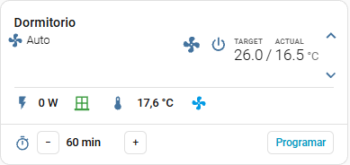
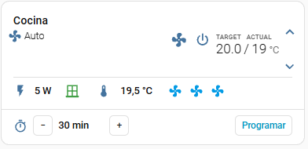
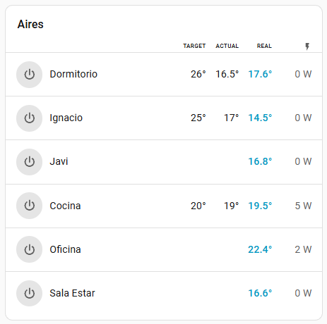

# AC Room Card

[](https://github.com/hacs/integration)


> 🇪🇸 [Léeme en español](README.es.md)

A Lovelace card that **wraps your existing climate card** and adds the row it is
always missing: live power draw, window state, room temperature, room fans, and a
built-in **shutdown timer**.



Your climate card, untouched, with a line of live data under it and a shutdown
timer below that. Here the room is off, the window is closed (green), the room
sensor reads 17.6 °C and the ceiling fan is idle (blue).



A room with three fans, all on the same line.

## Why

Most climate cards show temperature and mode, and nothing else. But the questions
you actually have about an air conditioner are *is it drawing power right now*,
*is a window open while it runs*, and *when will it turn off*. This card adds
exactly that, without replacing the card you already like.

It does not reimplement a thermostat. It instantiates **any** other card at
runtime through `loadCardHelpers()` and draws around it, so you keep that card's
behaviour, translations and updates.

**No dependencies, no build step.** One `.js` file.

---

## Two cards in one file

| Card | What it is |
|---|---|
| `custom:ac-room-card` | One room, full detail. Wraps your climate card. |
| `custom:ac-rooms-card` | Several rooms, one compact line each. Built for phones. |

Both ship in the same `.js`, so one install gives you both.

---

## Installation

### HACS (custom repository)

1. HACS → three-dot menu → **Custom repositories**
2. URL: `https://github.com/tsmithf2020/ac-room-card`, category **Dashboard**
3. Install, then hard-reload your browser (Ctrl+Shift+R)

### Manual

1. Copy `ac-room-card.js` to `/config/www/ac-room-card/`
2. Settings → Dashboards → three-dot menu → **Resources** → Add
   `/local/ac-room-card/ac-room-card.js` as a **JavaScript Module**
3. Hard-reload your browser

> If you install through HACS **and** manually, the card is loaded twice from two
> different URLs. It will not crash — the second registration is ignored — but
> whichever loads first wins, and updates will appear not to apply. Keep only one.

---

## Quick start

The card is fully configurable **from the UI**. Add it, pick your climate entity,
and fill in whatever sensors you have. Everything except `entity` is optional and
hides itself when absent.

Minimal:

```yaml
type: custom:ac-room-card
entity: climate.bedroom
```

Nothing here is required on its own. A room with no air conditioner at all works
too — leave `entity` out and no card is drawn on top, leaving just the data line
and whatever else you configure:

```yaml
type: custom:ac-room-card
name: Garage
window_entity: [binary_sensor.garage_door]
fans: [fan.garage]
```

Each element on the line appears only when you give it its entity: no power
sensor, no bolt.

Realistic:

```yaml
type: custom:ac-room-card
name: Bedroom
entity: climate.bedroom
power_entity: sensor.bedroom_ac_power
temp_entity: sensor.bedroom_temperature
window_entity: binary_sensor.bedroom_window
fans: [fan.bedroom_ceiling]
timer:
  entity: timer.bedroom_ac
  minutes_entity: input_number.bedroom_ac_minutes
  button_entity: input_button.bedroom_ac_timer
```

---

## Options

| Option | Type | Required | Description |
|---|---|:--:|---|
| `entity` | string | no | `climate.*`. Also accepts `input_boolean.*` / `switch.*` for IR units — see [Mode selector](#mode-selector-cool--heat). **Leave it out and no card is drawn on top** — useful for a room with sensors but no air conditioner. |
| `name` | string | no | Title drawn above everything. When set it is **not** passed to the wrapped card, so you do not see it twice. |
| `icon` | string | no | Icon next to the title. No icon by default. |
| `power_entity` | string | no | Power sensor (W). |
| `temp_entity` | string | no | Room temperature sensor. |
| `window_entity` | string \| list | no | One or more window sensors — see [Windows](#windows). |
| `battery_warn` | number | no | Low-battery threshold in %, default `20`. |
| `fans` | list | no | Room fans — see [Fans](#fans). |
| `fans_position` | string | no | `inline` (default), `auto` or `row`. |
| `fan_mode` | bool | no | Show the **unit's own** fan speed (`fan_modes` of the climate entity). |
| `fan_mode_names` | map | no | Rename those speeds, e.g. `auto: Automatic`. |
| `energy_today_entity` | string | no | Energy used today. |
| `energy_month_entity` | string | no | Energy used this month. |
| `timer` | map | no | Built-in shutdown timer — see [Timer](#timer). |
| `modes` | list | no | Cool/heat selector for units without a `climate` entity. |
| `base_card` | map \| `false` | no | Full config of the card to wrap. Defaults to the built-in `thermostat`; `false` draws nothing on top. |
| `base_card_style` | string \| map | no | CSS injected **inside** the wrapped card's shadow DOM. |
| `show_warning` | bool | no | Text banner when a window is open while the unit runs. Off by default — the red icon already says it. |
| `features` | list | no | Passed to the built-in `thermostat`. Ignored when `base_card` is set. |
| `labels` | map | no | Override any UI string. |

---

## Windows

```yaml
window_entity: binary_sensor.bedroom_window          # one

window_entity:                                        # or several
  - binary_sensor.bedroom_north
  - binary_sensor.bedroom_south
```

| State | Colour |
|---|---|
| All closed | 🟢 green |
| **Some** open | 🟠 orange |
| All open | 🔴 red |
| No data | ⚪ grey |

With a single window orange can never happen, so it only ever means "partially
open". The tooltip lists every window with its state and, when there is more than
one, an `open/total` count. Tapping opens the more-info dialog of the first open
window.

### Low battery

Door and window sensors are battery-powered, and a dead one is a **silent
failure**: it stops reporting and the window looks closed forever. Give each
window its battery sensor and the card puts a small red dot on the icon when any
of them drops below `battery_warn`:

```yaml
window_entity:
  - entity: binary_sensor.bedroom_north
    battery: sensor.bedroom_north_battery
  - entity: binary_sensor.bedroom_south
    battery: sensor.bedroom_south_battery
battery_warn: 20
```

The tooltip on the dot says which sensor and what percentage.

---

## Fans

```yaml
fans:
  - fan.bedroom_ceiling           # just the entity_id
  - entity: switch.bedroom_floor  # or an object, for a custom name and icon
    name: Floor fan
    icon: mdi:fan
  - entity: input_boolean.summer_mode   # any toggleable entity works
    name: Summer mode
    icon: mdi:white-balance-sunny
    color: var(--warning-color)         # its own colour when on
    position: start                     # before the power reading
```

They all sit **on the data line**, next to power and temperature — three fit
comfortably. `fans_position` changes that: `auto` puts one on the line and gives
two or more their own row below the timer, and `row` always uses a separate
row. Same compact button either way: just
the icon, no frame. The name lives in the tooltip.

Tap to toggle. **Green when on** (with the icon spinning), **blue when off** —
or give an entry its own `color` for the on state, any CSS colour or theme
variable.

The list is not limited to fans: toggling uses `homeassistant.toggle`, so any
switchable entity fits here — a summer-mode helper, a heater, whatever belongs
on that line.

Entries land after the temperature by default. `position: start` puts one
**before the power reading** instead, which reads better for something that is a
mode rather than a device.
Accepts `fan`, `switch` and `light` entities — some fans end up exposed in the
`light` domain — because toggling uses `homeassistant.toggle`.

> These are the **room's** fans. For the air conditioner's own fan speed, see
> `fan_mode` below.

---

## Unit fan speed

```yaml
fan_mode: true
fan_mode_names:
  auto: Automatic
  silent: Quiet
```

A dropdown with the speeds the `climate` entity declares (`silent`, `low`,
`medium`, `high`, `auto`, ...), showing the current one. Selecting one calls
`climate.set_fan_mode`. Nothing is drawn if the unit declares no `fan_modes`.

---

## Timer

> **This does not work on its own.** Home Assistant has no built-in shutdown
> timer for climate entities: you need three helpers and one automation. The card
> draws and drives the countdown, **but it is the automation that turns the unit
> off.** Everything you need is below.

### 1. Create the helpers

In `configuration.yaml` (or through Settings → Devices & Services → Helpers).
Replace `bedroom` with your room:

```yaml
input_number:
  bedroom_ac_minutes:
    name: Bedroom AC minutes
    icon: mdi:hvac
    min: 0
    max: 480
    step: 30
    unit_of_measurement: min
    mode: slider

input_button:
  bedroom_ac_timer:
    name: Bedroom AC timer
    icon: mdi:home-thermometer

timer:
  bedroom_ac:
    name: Bedroom AC timer
    duration: "00:00:00"
    restore: false
```

Apply without restarting: Developer Tools → Actions → `input_number.reload`,
`input_button.reload` and `timer.reload`.

### 2. Create the automation

```yaml
alias: AC - auto-off timer BEDROOM
mode: restart
triggers:
  - trigger: state
    entity_id: input_button.bedroom_ac_timer
    id: start
  - trigger: event
    event_type: timer.finished
    event_data:
      entity_id: timer.bedroom_ac
    id: finished
  - trigger: state
    entity_id: climate.bedroom
    to: "off"
    not_from: [unavailable, unknown]
    id: manual_off
conditions: []
actions:
  - choose:
      # Start, only if the unit is running and minutes are set
      - conditions:
          - condition: trigger
            id: start
          - condition: numeric_state
            entity_id: input_number.bedroom_ac_minutes
            above: 0
          - condition: template
            value_template: "{{ states('climate.bedroom') != 'off' }}"
        sequence:
          - action: timer.start
            target:
              entity_id: timer.bedroom_ac
            data:
              duration: "{{ (states('input_number.bedroom_ac_minutes') | int) * 60 }}"
      # Time is up: turn it off
      - conditions:
          - condition: trigger
            id: finished
        sequence:
          - action: climate.turn_off
            target:
              entity_id: climate.bedroom
      # Turned off by hand first: cancel the countdown
      - conditions:
          - condition: trigger
            id: manual_off
          - condition: state
            entity_id: timer.bedroom_ac
            state: active
        sequence:
          - action: timer.cancel
            target:
              entity_id: timer.bedroom_ac
```

Two details that save you grief. `above: 0` stops a zero-minute timer from
finishing instantly and killing the unit the moment you press the button. And
`not_from: [unavailable, unknown]` keeps a reconnect from cancelling a running
countdown.

For a unit without a `climate` entity, swap `climate.turn_off` for
`input_boolean.turn_off` and point the conditions at that boolean.

### 3. Point the card at them

```yaml
timer:
  entity: timer.bedroom_ac                       # required
  minutes_entity: input_number.bedroom_ac_minutes
  button_entity: input_button.bedroom_ac_timer   # optional but recommended
```

Idle, the card shows the minutes with `−` / `+` (honouring the `input_number`
`step`, `min` and `max`) and a **Schedule** button. Running, it shows the
countdown and the button becomes **Cancel**.

`button_entity` is optional but worth setting: pressing it fires *your*
`input_button`, so your automation stays in charge and applies its checks.
Without it the card calls `timer.start` directly, skipping them — and you still
need the automation for the `timer.finished` half.

The countdown is computed in the browser from `finishes_at`, with an interval
that only runs while the timer is active. No template sensor ticking every second
into your recorder.

---

## Mode selector (cool / heat)

For IR units with no `climate` entity, driven by one `input_boolean` per mode:

```yaml
type: custom:ac-room-card
name: Kids room
entity: input_boolean.kids_ac
modes:
  - name: Cool
    entity: input_boolean.kids_ac
    icon: mdi:snowflake
  - name: Heat
    entity: input_boolean.kids_ac_heat
    icon: mdi:fire
```

Draws **Off / Cool / Heat** and marks the active one. With a single mode it
becomes a plain on/off.

Switching **turns the other booleans off first, then turns the chosen one on**.
The order matters: if each boolean fires an IR scene, doing it the other way
round leaves the unit off, because the previous mode's "off" arrives after the
new mode's "on".

With `modes` and no `base_card` the card wraps nothing and draws itself
completely.

> Each boolean must be wired to whatever actually drives the unit — a scene, a
> `remote.send_command`, whatever you use. The card flips the boolean; it does
> not know how to send IR.

---

## Wrapping another card

```yaml
base_card:
  type: custom:mini-climate
  fan_mode:
    hide: false
```

`base_card` takes the complete config of any card, custom or built-in. Without
it, the built-in `thermostat` is used for `climate` entities and a `tile` for
anything else. If `base_card` has no `entity`, it inherits the one above.

### Restyling the wrapped card

A card from HACS lives in its own shadow DOM, so your CSS cannot reach it.
`base_card_style` injects CSS in there. As a **map**, each key is a selector for
an element with its own shadow root, and the empty key is the wrapped card's own
root:

```yaml
base_card_style:
  "": |
    .mc-climate { padding-top: 0 !important; }
  mc-temperature: |
    .state__value:nth-of-type(1)::before { content: "Target"; }
```

Nested elements mount after the card, so injection retries until it finds them.

---

## Troubleshooting

**The visual editor says it is not available.** You almost certainly have the
card loaded twice — check Settings → Dashboards → Resources for both a `/local/`
and a `/hacsfiles/` entry, and delete one.

**An update does not seem to apply.** Same cause, or browser cache. Hard-reload
with Ctrl+Shift+R.

**The fan icon never changes colour.** Fixed in 0.14.0. Update.

**Nothing shows next to the power reading.** Every element hides itself when its
entity is missing. Check the entity IDs in the visual editor.

---

## AC Rooms Card

A compact list — one line per room — for a phone dashboard, where six full cards
mean six screens of scrolling.



Six rooms, one line each. Two of them have no `climate` entity — they are IR
units driven by an `input_boolean`, so they only fill the **Real** column.

```yaml
type: custom:ac-rooms-card
title: Air conditioning
columns: [temps, power]   # optional: keep the line to the essentials
rooms:
  - entity: climate.bedroom
    name: Bedroom
    power_entity: sensor.bedroom_ac_power
    temp_entity: sensor.bedroom_temperature
    window_entity: [binary_sensor.bedroom_window]
    fans: [fan.bedroom_ceiling]
    timer:
      entity: timer.bedroom_ac
      minutes_entity: input_number.bedroom_ac_minutes
      button_entity: input_button.bedroom_ac_timer
  - entity: input_boolean.kids_ac
    name: Kids room
    modes:
      - entity: input_boolean.kids_ac
      - entity: input_boolean.kids_ac_heat
```

Each room takes **the same block as `ac-room-card`**, so you can copy a card's
config straight in. Fields it uses: `entity`, `name`, `power_entity`,
`temp_entity`, `window_entity` (with battery), `fans`, `modes`, `timer`,
`battery_warn`.

A running timer shows its countdown in orange; tap to cancel. Idle, it is just
an icon you tap to start — and it hides itself when the room is off, since there
is nothing to schedule.

| Element | Tap |
|---|---|
| Power button | Turns the room on/off |
| Name or temperatures | Opens the room's full card in a popup (`popup: false` for more-info instead) |
| Power reading | More-info of the power sensor |
| Window icon | More-info of the first open window |
| Timer | Starts it (or cancels a running one) |
| Fan icons | Toggles that fan |

`columns` picks what the line shows, from `temps`, `power`, `window`, `timer`
and `fans`. All five by default. On a phone `[temps, power]` reads best — room
names stop being truncated, and everything else is one tap away in the popup.

Columns are fixed-width and the fan column is sized from whichever room has the
most, so every icon lands in the same place down the list instead of drifting
with each row's contents. A room without a window or a timer keeps its slot
empty rather than pulling everything left.

Tapping a room's name opens **the full `ac-room-card` in a popup**, built from
that room's own config — so the line can stay readable on a phone and the detail
is one tap away. Set `popup: false` on the card to get the more-info dialog
instead.

Three temperatures, deliberately kept apart:

| Column | Where it comes from |
|---|---|
| **Target** | the unit's setpoint (`temperature`) |
| **Actual** | what the **unit itself** measures (`current_temperature`) |
| **Real** | your own room sensor (`temp_entity`) |

The last two rarely agree — the unit measures inside its own casing, often a
couple of degrees off from the middle of the room. Showing them side by side is
the point. Rename them with `labels: {target, actual, real}`.

The labels are drawn **once**, as a column header — with a bolt over the power
column. Repeating them on every row would be noise.

On narrow screens the columns tighten instead of dropping the power reading:
on a phone, what the unit is drawing right now is one of the things you most
want to see. Windows and batteries use the same
green/orange/red logic as the full card. Below 380 px the power column hides
itself to keep the line readable.

### Row colour by mode

A running room tints its whole row: **light blue for cooling, orange for
heating**, and a green tint for `dry`. Off rooms stay neutral. The power button
picks up the same colour, so a glance down the list tells you what every unit is
doing without reading anything.

For rooms driven by `input_boolean` modes the mode is inferred from its name or
entity id (`cool`/`frio`, `heat`/`calor`/`calef`). Say it explicitly when the
names do not give it away:

```yaml
modes:
  - entity: input_boolean.kids_ac
    name: Cool
    hvac: cool
  - entity: input_boolean.kids_ac_heat
    name: Heat
    hvac: heat
```

`sort: active` puts running rooms on top. **Leave it out to keep your order** —
otherwise rows jump around as rooms turn on and off, which is disorienting when
you are aiming at a button.

## Development

```bash
node test/smoke.js
```

217 assertions, no browser: a minimal DOM shim exercises value formatting,
elements hiding when their entity is absent, unavailable sensors, window states
and battery, fan toggling, timer countdown and service calls, and the visual
editor's config round-trip.

There is no build step. Edit `ac-room-card.js`, run the tests, commit.

## License

MIT — see [LICENSE](LICENSE).
